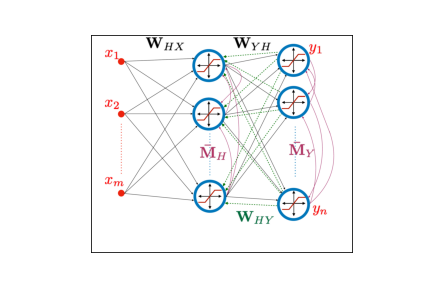

# Biologically-Plausible Determinant Maximization Neural Networks for Blind Separation of Correlated Sources

This Github repository includes the implementation of the proposed approaches presented in the paper, which is accepted at NeurIPS 2022.

## DetMax Neural Networks
 
